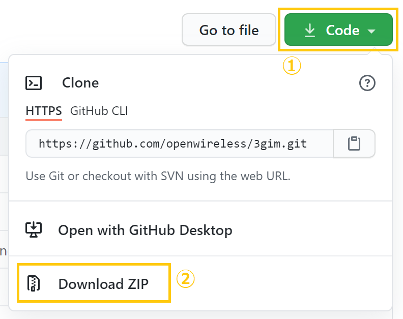

# Arduino library for 3GIM(V2.2-), 4GIM(V1-), SGIM(V1-) and MGIM(V4.1-)

## 概要
タブレインが企画・製造・販売している小型通信モジュール・小型マイコンボードを、Arduino IDEで簡単に利用するためのライブラリを公開します。

## ライブラリ
ここには、以下のライブラリを置いています。

| ライブラリ名 | 概要 | 補足 |
| --- | --- | --- |
| a3gim | Arduino UNO/Pro等、AVRマイコンで3GIMをソフトウェアシリアルを介して利用するライブラリ | |
| a3gim2 | Arduino Mega/101/Zero/M0/Mo Pro/Due等、ハードウェアシリアルを介して3GIMを使用するライブラリ | |
| a4gim | Arduino UNO/Pro等、AVRマイコンで4GIMをソフトウェアシリアルを介して利用するライブラリ | |
| a4gim2 | Arduino Mega/Zero//Due等、ハードウェアシリアルを介して4GIMを使用するライブラリ | |
| sgim | sgim(Sgifox通信モジュールを搭載したArduino Zero互換小型マイコンボード)を使用するためのライブラリ | |
| mgim | MGIM(LTE-M通信モジュールを搭載したArduino Zero互換小型マイコンボード)を使用するためのライブラリ | |
| hl7800 | MGIMに搭載されているLTE-M通信モジュールHL7800Mを使用するためのライブラリ | mgimで使用 |
| stts751 | SGIM,MGIMに搭載されている温度センサの制御ライブラリ | sgim/mgimで使用 |
| mma8451q | SGIMに搭載されている加速度センサの制御ライブラリ | sgimで使用 |
| lis2dw | MGIMに搭載されている加速度センサの制御ライブラリ | mgimで使用 |
| ambient_mgim | MGIMを使ってIoTクラウドサービスAmbientaを利用するためのライブラリ | mgimと一緒に使用 |

## Arduino IDEで、これらのライブラリを利用する方法
* このページから、ライブラリ一式をZIPファイルとしてダウンロードします。ダウンロードは、下記の図にあるように、本ページの右上にある「↓Code」ボタンを押してメニューを表示させ、「Download ZIP」を選択してください。


* ダウンロードしたZIPファイルを解凍して、3gim_masterフォルダをたとえばディスクトップに取り出します。
* 3gim_masterフォルダに降りて、その中にあるライブラリのフォルダのうち使いたいライブラリのフォルダを、デフォルトのスケッチフォルダにあるlibrariesの直下にコピーします。
    * コピーした後は、Arduino IDEをいったん終了して、再度、起動してください。
    * デフォルトのスケッチフォルダは、環境設定ダイアログの「スケッチブックの保存場所」で指定されている場所です。
      * Windows上のArduino IDEでは、ファイル → 環境設定.. で環境設定ダイアログを開きます
      * MacOS上のArduino IDEでは、Arduino → Preferences.. で環境設定ダイアログを開きます

## 利用上の注意点
* a3gim2またはa4gim2ライブラリは、3GIM/4GIMとの通信で使用するシリアルに合わせて、a3gim2.hまたはa4gim2.hで定義している下記のシンボルを書き換えてご利用ください。
  * a3gim2.h
```
    #define　a3gSerial　　　　 Serial　　　　// Use serial port
```

  * a4gim2.h
```
    #define　a4gsSerial　　　　Serial1　　　// Use serial port
```

* IoTAB(V1)と3GIM/4GIMの組み合わせで使用する場合は、上記の a3gSerial/a4gsSerialをSerialとして定義してください。
