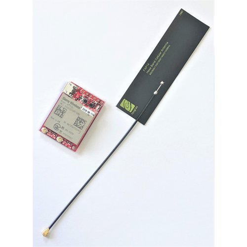
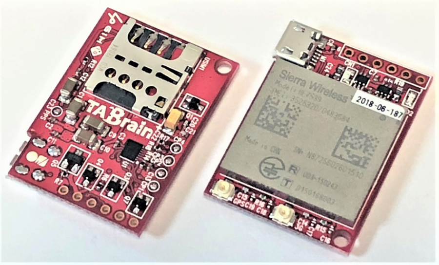
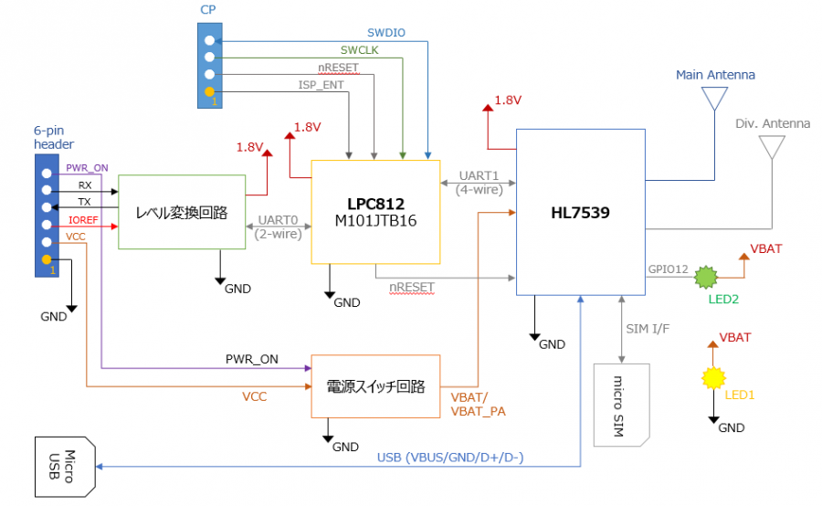
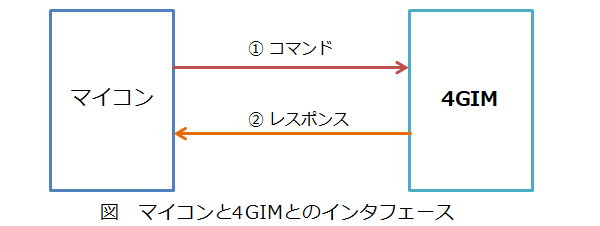

# 4GIM(4G IoT Module) Ver1 について

## 概要
**4GIM(フォージム)**は、様々なマイコンを使って、簡単にインターネット接続することができるSDカードサイズの**超小型4G(LTE)通信モジュール**です。ArduinoやRaspberry Pi、mbed等の様々なマイコンで簡単に利用することができます。

Ver1では、コアとなる通信モジュールとしてシエラワイヤレス製の**HL7539**を採用し、[[3gim_v2|3GIM Ver2.x]] と同じサイズ、ほぼ同一の機能を維持しています。4GIMと3GIM(V2.x)との違いは下記の通りです：

  * **FOMAサービス(3G)の代わりにXiサービス(4G)を利用**
    * 3Gよりも遅延の少ない通信を利用できる
    * オプションのサブアンテナを利用することで、より高感度に利用できる
    * 3GIMと同様に、低コストなMVNOのSIM(docomo系)が利用可能できる（すべてのMVNOのSIMカードでの利用を保証するものではありません）
  * **GPS機能の削除**
    * HL7539にはGPS機能が備わっていないため、4GIMではGPS機能を搭載していない
  * **UDP機能の提供**
    * GPS機能の代わりに、簡単に、素早くデータをサーバへ送信できるUDP機能を提供する

## 外観

4GIM(V1)プロトタイプの画像を掲載します。
なお、基板の色やレイアウト・寸法等は、今後変更となる場合がありますのでご注意ください。

### 全体
  * 左から4GIM(V1)本体、4Gフレキアンテナです。

### 表面
  * 右上の6穴(2.54mmピッチ)でマイコンと接続します。
  * メインアンテナ(必須)とサブアンテナ(オプション)の2つのアンテナを接続することができます。

## 提供する機能

4GIM(V1)は、3gim(V2.x)と互換性のある下記の機能を提供します（ただし、UDP機能は4GIMで追加した機能です）
  * 4Gを介したTCP、UDPおよびHTTP/HTTPS機能((対応できるSSL証明書には一部制約があります。すべてのサーバに対してHTTPS通信ができることを保証する訳ではありません))
  * 時刻取得
  * 省電力の制御
  * その他機能(電波強度の取得、ボーレートの変更、APNの切り替え等((利用可能なSIMカードについては、「利用上の留意点」をご覧ください)

4GIM(V1)をUART経由で利用する場合は、3GIMと同程度の通信速度(最大115200bps)となります。高解像度の画像等の大きなデータをサーバへ送信するには、Raspberry PI等のLinuxマイコンを使い、USB経由で接続する形態での利用をお勧めします。Raspberry PIで4GIM(V1)を使う方法は、3GIM(V2)と同様です。詳しくは、[ラズベリーパイで使用する方法](#ラズベリーパイで使用する方法) のページを参考にしてください。

また、3GIM(V2.1)と同様に、SMS機能(ショートメッセージ機能)は提供しませんのでご注意ください。

## 4GIMのスペック

| 項目 | 仕様 | 補足 |
| --- | --- | --- |
|外形寸法|幅25mm * 奥行35mm * 高さ7mm|3GIMと同一サイズ。取付穴は2.6mm径(1ヶ所)|
|電源電圧|3.3～4.2V|安定した3.3～4VのDC電源または3.7Vリチウムポリマ電池を推奨(5Vの供給は不可)|
|消費電流|10(sleep時)～700mA(peak時)|利用状況や電波状態に依存|
|4G対応バンド|LTE(Band1/19/21)|docomo(Xi)のIOT取得済。Band3には非対応|
|マイコンとのインタフェース|UARTを介したコマンド・レスポンス方式 または USBモデム|仕様書は別途公開|
|添付アンテナ|同梱するフレキシブルアンテナ|シールとして非金属製のケースに貼付可|
|ロジック電圧|任意のロジック電圧で利用可能(4GIMにIO電圧を供給)||
|UART|デフォルト設定は9600bps(最大115200bps)/8データビット/パリティなし/1ストップビット|ボーレートは変更可（ただし、4GIMでもハードウェアフロー制御ができないことから、3GIMと同じ最大通信速度としている）|
|USB 2.0|ATコマンドを利用可能|
|対応SIMカード|microSIM/miniSIM|通常サイズのSIMカードは利用不可。利用実績のあるSIMカードは[[sim|こちら]]|
|添付品(予定)|4GIM本体1個、フレキアンテナ1個、8ピンヘッダ1個|サブアンテナを利用される場合は、別売のサブアンテナをご購入ください|

## ピン配置

4GIMは下表に示す6つのピンでマイコンと接続します。ピン配置は3GIMと同一ですので、ハードウェアとしては差し替えての利用が可能です。

| ピン番号 | 名称 | 機能など |
| --- | --- | --- |
|1|PWR_ON|電源のON/OFF制御(開放または0でON、1でOFF)|
|2|RX|UARTインタフェース(RX)|
|3|TX|UARTインタフェース(TX)|
|4|IOREF|PWR_ON,RX,TXのロジック電圧|
|5|VCC|電源|
|6|GND|グラウンド|

## ブロック構成図
4GIM(V1)の内部ブロック図を下記に示す：

## 機能一覧(UART経由で利用する場合)

### UARTコマンドインタフェースの概要

  * 4GIMは、UART経由で外部(マイコン側)からコマンドを送受信することで利用できます。
  * すべてのインタフェースは、マイコン側からのコマンド送信を契機とします。結果はレスポンスとして、4GIMからマイコン側へ送信されます。
  * コマンドおよびレスポンスは、必ず改行コード('\n')で終端します。
  * すべてのコマンドは、一つのシーケンス（送信と受信のやり取り）で完結します。ただし、 TCPでデータを直接書き込む時（$TTコマンド）は上記の例外で、データを複数回に分けてマイコン側から4GIMへ送ることができます。所定のバイト数のデータを送り終わったときに、4GIM側からレスポンスがあります。

  * 起動直後の出力について
　　　4GIMに電源を供給してONにした後、約14秒後に下記の1行のメッセージが出力されます：
　　　<file> Welcome to 4GIM(V1) </file>
　　　このメッセージにより4GIMが利用可能になったことを検知することが可能ですが、
　　　代わりに、一定時間（約14秒間）を待ってこの出力を無視すること(読み捨てること)もできます。

  * 3GIM(V2.x)との差異について
    * GPS機能の削除
    * UDP機能の追加

## 機能一覧

下表に提供機能の一覧を示します。

| 分類 | 機能名 | 機能概要 | コマンド名 | 備考 |
| --- | --- | --- | --- | --- |
|System|バージョンの取得|3GIMに搭載されているファームウェアのバージョン情報を取得する|$YV| |
| |電波受信強度(RSSI)の取得|現在の3Gの電波強度(単位はdBm)を取得する|$YR| |
| |利用可能サービスの取得|現在のSIMカードで利用可能なサービス(無効/パケット通信可)を取得する|$YS| |
| |IMEIの取得|端末固有の識別番号(IMEI:International Mobile Equipment Identity)を取得する|$YI| |
| |LEDの状態の取得・設定|LEDの現在の状態の取得あるいは設定する|$YL|LEDは基板上にLED1と表記された緑色のLED|
| |UART通信速度の変更|UARTの通信速度を(4800/9600/19200/38400/57600/115200bps)変更する|$YB|実行後ただちに有効となる|
| |3GIMのリセット|3GIMをソフトリセットする|$YE| |
| |現在の日時の取得|現在の年月日、時分秒を取得する|$YT| |
| |エアプレーンモードの切り替え|エアプレーンモードの現在の状態の取得あるいは設定する|$YP|エアプレーンモードにすると消費電力を大きく節減可|
| |ATコマンドパススルーモード|ATコマンドパススルーモードに入り、ATコマンドを実行する|$YA|指定された時間経過後に通常モードに戻ることができる|
|Web|GETリクエスト送信・レスポンス取得|HTTP/HTTPSのGETメソッドを送信して、レスポンスを取得する|$WG|DNS使用可。ヘッダ、URL、レスポンスには最大長の制限有|
| |POSTリクエスト送信・レスポンス取得|HTTP/HTTPSのPOSTメソッドを送信して、レスポンスを取得する|$WP|同上|
|TCP/IP|TCP/IPコネクションの接続|TCP/IPコネクションを接続する|$TC|DNS使用可。一度に一つのコネクションのみ|
| |TCP/IPコネクションの切断|TCP/IPコネクションを切断する|$TD| |
| |TCP/IPコネクションからのデータ読み出し|TCP/IPコネクションから指定された長さまでデータを読み出す|$TR|ノンブロッキング方式。バイナリデータも取扱可 1.|
| |TCP/IPコネクションへのデータの書き込み|TCP/IPコネクションへデータを書き込む|$TW|ノンブロッキング方式。バイナリデータも取扱可|
| |TCP/IPコネクションへのデータの直接書き込み|TCP/IPコネクションへデータを直接書き込む|$TT|バイナリデータもそのままで取扱可。最大32000バイトまでを一気に書き込み可|
| |TCP/IPコネクションの状態の取得・設定|TCP/IPコネクションの状態を取得する|$TS| |
| |TCP/IPの自ソケットのIPアドレス・ポート番号の取得|自ソケットのIPアドレスを取得する|$TN| |
| |タイムアウト時間の設定|TCP/IP機能で使用するタイムアウト時間を取得・設定する|$TX|$TC/$TW機能に影響 |
|UDP|UDPの開始|UDP機能の開始|$UB||
| |UDPの終了|UDP機能の終了|$UE| |
| |UDP/IPによるデータ送信|UDP/IPを使って指定した宛先へデータを送信する|$US|1回の送信データが一つのパケットとして送信される|
| |UDP/IPの自ソケットのIPアドレス・ポート番号の取得|自ソケットのIPアドレスを取得する|$UN| |
|Profile|デフォルトプロファイルの取得・設定|使用するプロファイル(APN)を設定する|$PS||
### 補足

  - 一部のデータではエスケープ処理($文字を使用)が必要となる。
  - UDPとTCP機能では、各々一つのコネクションまで利用できる（つまり、同時に利用できる）
  - 上記コマンドの詳細は、ダウンロードページにある「**4GIM(V1)のマニュアル**」を参照ください。

## 利用上の留意点
  - 4GIMのアンテナコネクタ脇に印刷されているシルク印刷に、表記の間違いがありました。4Gメインアンテナは「3G」とシルク印刷されているコネクタに、4Gサブアンテナは「GPS」とシルク印刷されているコネクタに、それぞれ接続してください。4Gサブアンテナは感度を上げるためのもので、接続しなくても構いません（オプション）。
  - docomoのXi回線を利用します。そのため、docomoあるいはそのネットワークを利用するMVNOが提供するLTE向けのマイクロSIMが利用できます（ただし、これらの条件を満たす全てのSIMカードでの利用を保証する訳ではありません。利用実績のあるSIMカードは [[sim|こちらのページ]] を参照ください）
  - 4GIMは日本国内でのみ利用できます。海外では各国の法律により現状では利用できません。海外でのご利用は個別にご相談ください。
  - USBモデムとして利用する場合でも、5番ピンからの電源供給は必要となります。

## 4GIM、ファームウェア、Arduino用ライブラリの最新バージョンの関係について
最新のバージョンは下記の通りです：

| 4GIMハードウェア | ファームウェア(gw4g) | a4gimライブラリ |
| --- | --- | --- |
|1.0|1.0|R1.0|

## 電源について

  * 4GIM(V1)を動作させるためには、最大700mA程度の電流を供給できる3.3～4.2Vの安定した電源が必要です。電圧が中途半端であるため、そのままで使える電源モジュールはあまり市販されていません。Arduinoで利用される場合は、[3GIMシールド(V2) for Arduino](https://www.switch-science.com/catalog/2984/) を利用されるのも一つの方法です。
  * 入手しやすい手ごろな電源モジュールとして、秋月電子通商から販売されている [下記のモジュール](http://akizukidenshi.com/catalog/g/gK-09982/|ＬＸＤＣ５５使用ＤＣＤＣコンバータキット（可変出力）) があります。このモジュールはピンを半田付けする必要がありますが、最大1.5Aまでの電流を安定的に供給することができます。また、入力電圧の範囲が広く（4～14V）、DC-DCコンバータ方式ですので電力効率が高いため発熱が少ない特長があります。通常、4GIM(V1)には3.7V前後の電圧の電源を供給します。LXDC55では、入力電圧は出力電圧よりも1V以上高いことが推奨されていますので、概ね5V以上の電圧を入力として供給することを推奨します。
  * 4GIMと、4GIMを制御するマイコンの電源回路は、兼用とはせず、二つに分離することを推奨します。4GIMは電源をONにした際に急激に電流が流れますので、瞬間的に電圧が大きく低下する傾向にあります。そのため、制御する側のマイコンと4GIMを同一の電源回路とした場合、4GIMをONにした瞬間に、電源電圧の降下によりマイコンがリセットされる可能性が高いです。電源回路を二つに分離することで、この問題は解消することができます。

## トラブルシューティング

[トラブルシューティング](docs/xgim_troubleshooting.md) を参照ください。

## ラズベリーパイで使用する方法

[3GIM(V2)をラズパイで使用する](docs/3gim_raspi.md) にて、3GIM(V2)をラズパイで使用する方法を掲載しています。4GIM(V1)を使用する場合も方法は同じです。

## ダウンロード

  * 4GIM(V1) 回路図
    * [4gim schematic](docs/4gim_v1_sch.pdf)

  * 4GIM(V1) 用 Arduinoライブラリ
    * [4gim library for Arduino](https://github.com/openwireless/3gim)

## 購入方法

* スイッチサイエンス様で購入できます
  * [4GIM(V1) (LTE版フレキアンテナ付き)](https://www.switch-science.com/catalog/4087/)

## 事例

4GIMを使った製作事例を随時掲載していく予定です。
