# ルート証明書の取得方法について

HTTPS/GETあるいはHTTPS/POSTを使用する場合は、予め接続先のサーバのルート証明書を取得しておく必要があります。
取得したルート証明書は、hl7800ライブラリのsetRootCA()メソッドを使ってHL7800内に設定します。

サーバのルート証明書を取得する手順を以下に示します。この手順例では、Google Chromeブラウザを使って、情報通信研究機構(NICT)のサイトからルート証明書を取得する例を示します。他のブラウザ(Microsoft Edge等)でも同様の手順で取得することができます。

(1) [NICTのサイト](https://www.nict.go.jp/) にアクセスします

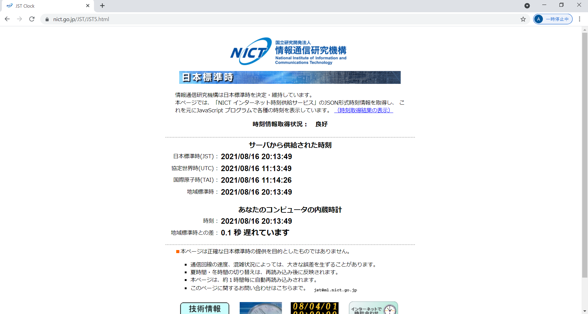

(2) HTTPSのアイコンをクリックしてポップアップメニューを表示させ、「証明書（有効）」を選択する

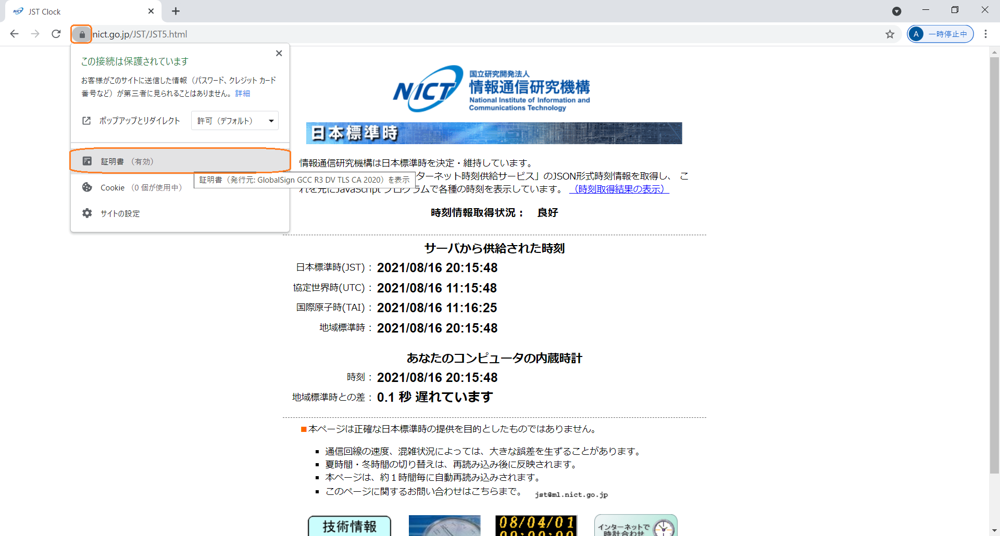

(3) 以下、画面コピーの通りに順次操作をして、ルート証明書をBase64 X509形式でダウンロードする

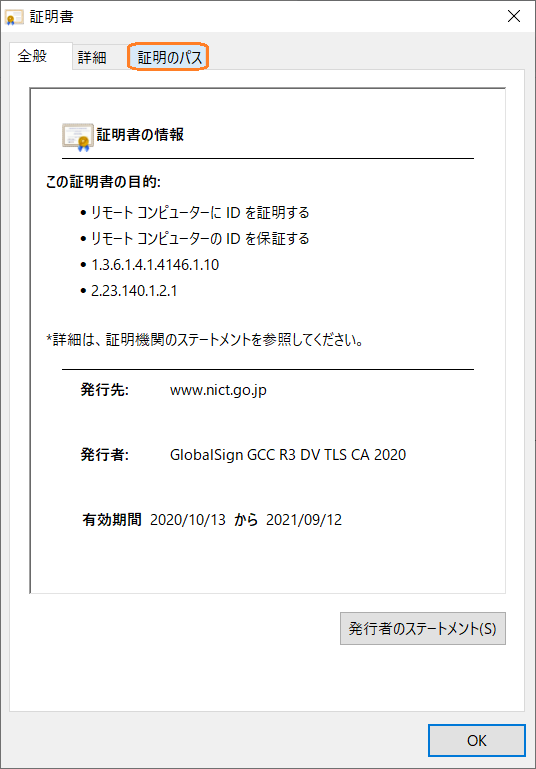
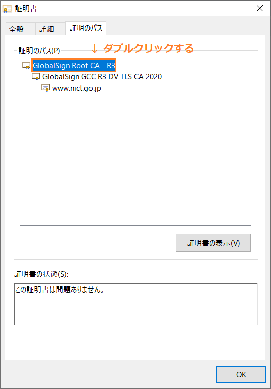
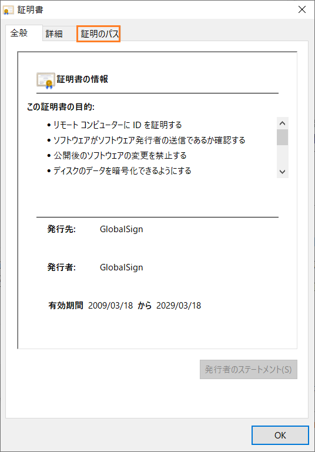
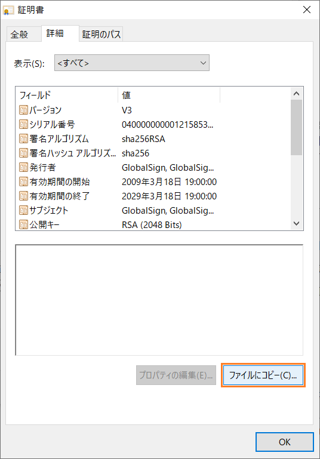
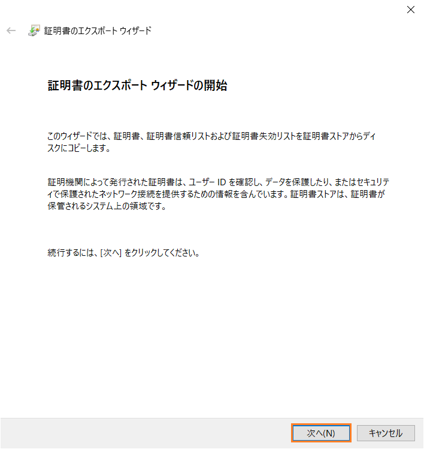
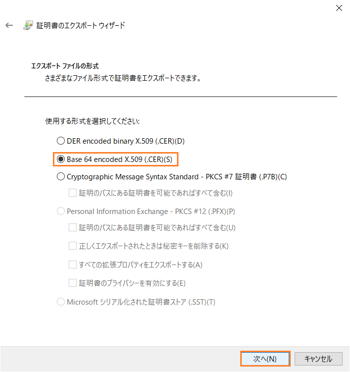
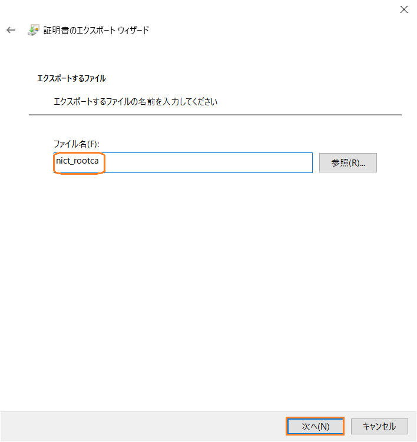
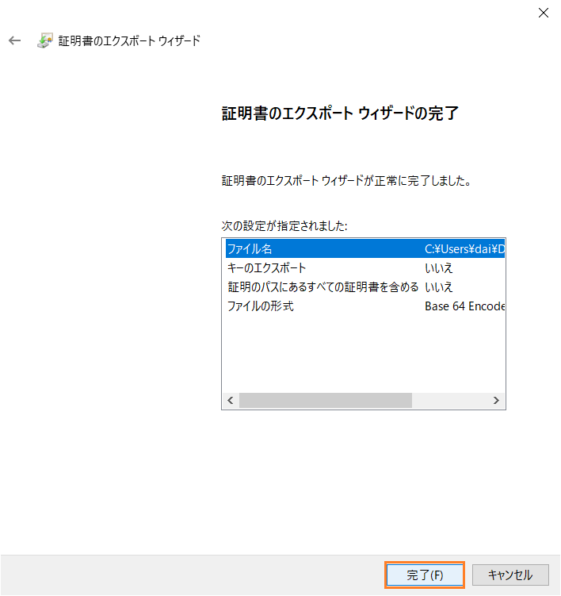
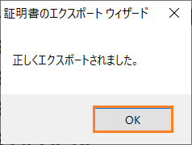

(4) 取得したルート証明書をメモ帳で開くと、このような内容となっている。

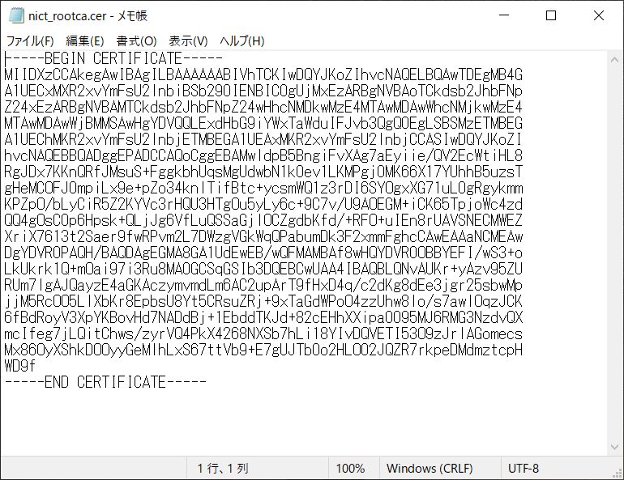

上記の操作で取得したルート証明書の内容を、サンプルスケッチhttps_getにあるようにスケッチ中に埋め込みます。

--
